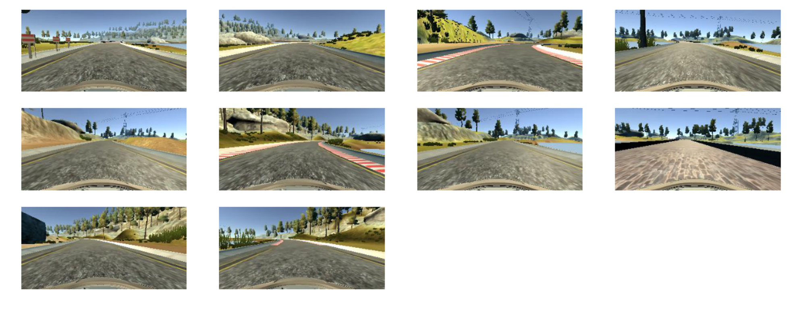
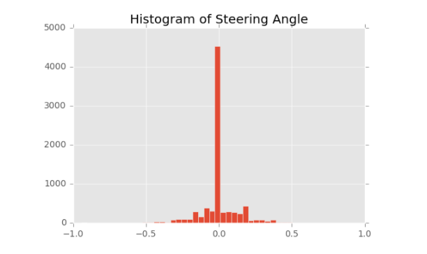
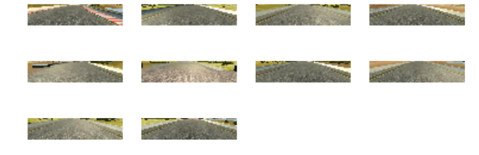
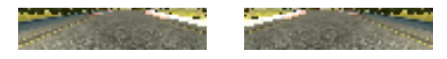
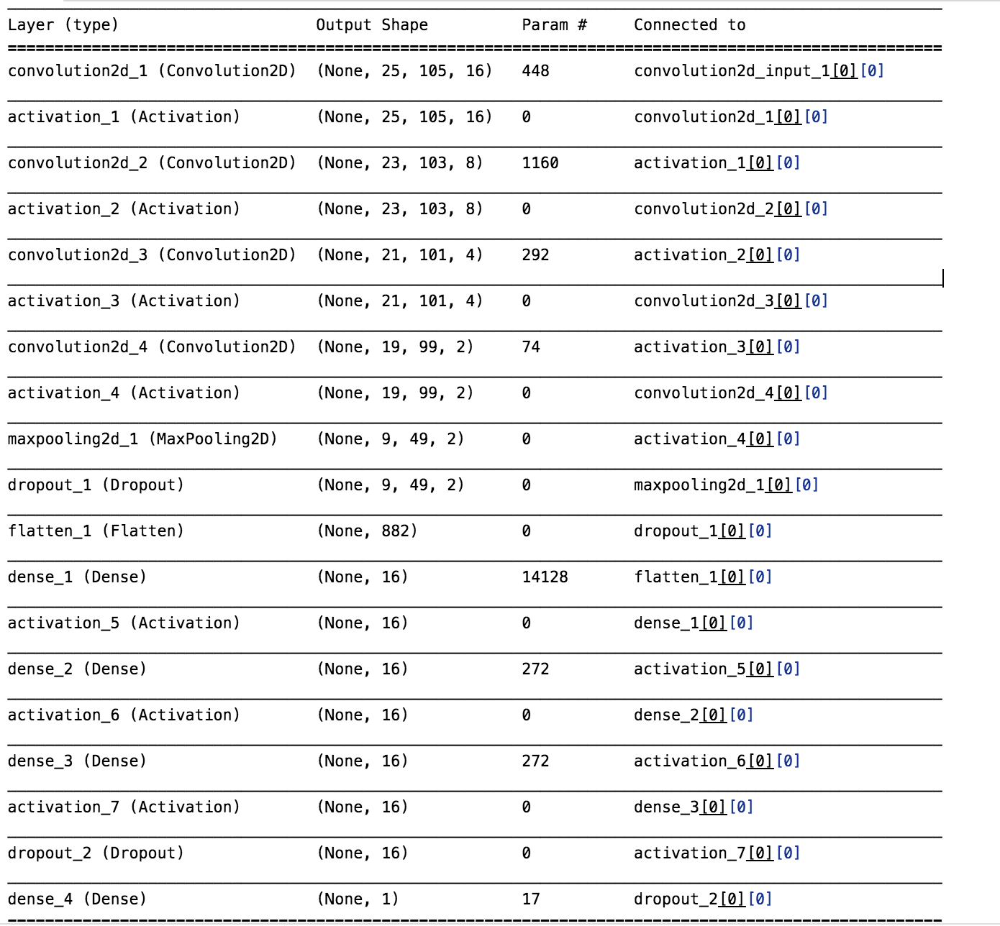

# CarND-behavioral-cloning

##Overview
The goal of this project is to clone the driving behavious in a model using deep learning. We drive car in a simulator and capture the training data. Using that training data, model is trained and finally using this model, the car is driven autonomously in the simulator.  I follow the following steps to accomplish this.  
  1. record the training data
  2. load the driving log in memory  
  2. visualize the images and steering angle  
  3. preprocessing  
  4. build the model  
  5. feed the images/angle to model in batches using generator  
  6. fit the model   
  7. test the model  
  8. save the model  
  9. drive on track using the saved model  

##Preprocessing

Preprocessing image is the most critical part. Here are the images and angle sample before preprocessing. 

I took the following steps to ensure that I am feeding the quality data to model so it will train properly. In the raw images, there are a lot of background noise, trees and mountains  etc. They are not useful in training. They do create distraction in the model. So it is very important to crop the image to right size to only feed the portion of image that are important for model to learn. I cropped the images and selected only [65:145:3, 0: -1:3, :] area. That leave only image dimension of (27, 107, 3). Here are some sample images after the cropping

Second, data I collected from training track has images with steering on right. It is skew towards the steering towards right. To tackle that, I flip the images so that the data is more balanced. 

third, I have images from left, right and center camera along with steering angles. We need to adjust steering angle from left and right camera to get the correct input to our model. Also most of the angle in dataset are zero. Adjusting these angle give us more diversed datasets. I added +/- .20 to steering angle of the images of left and right camera. 

##feed the images/angle using generator  
I used generator to feed the images and angle to model. Instead of loading all images in memeory, the generator will iterate over and fetch only batch of images from disk. It allow me to train the model using a large size of dataset.  

##Model architecture
(Reference: https://github.com/wonjunee/behavioral-cloning)

Total params: 16663

##Training dataset 
I am using the training datasets provided by Udacity. I found it more accurate than the data I collected. The part of that training using keyboards does not produce the quality datasets. 

##Training and Testing 
Here are the different scenarios I tested. I experiement with two different architecture. One is baseed on NVIDIA's End to End Learning for Self-Driving Cars paper ( ModelB). And anoher one is described  https://github.com/wonjunee/behavioral-cloning ( ModelA). I stick with model A as it was giving better results on both tracks.  

|  Model | Steer Angle | Iters | batch | Learning rate | preprocess | Driving | Time on Track 2  |  Loss | Accuracy |
|  ------ | ------ | :------ | :------ | ------ | ------ | ------ | ------ | ------: | ------: |
|  Model A | 0.17 | 8 | 64 | 0.0012 | crop +normalize +flip | Middle of the road | 28 sec | 0.0145 | 0.1937 |
|  Model B | 0.2 | 8 | 64 | 0.0001 | crop +normalize +flip | Went offroad |  | 0.0201 | 0.1612 |
|  Model A | 0.17 | 8 | 64 | 0.0012 | crop +normalize +flip +gamma | Went offroad at gap of red traffic lanes | 2 mins | 0.0126 | 0.194 |
|  Model A | 0.17 | 5 | 64 | 0.0015 | crop +normalize +flip | Went offroad at gap of red traffic lanes |  | 0.0157 | `0.185` |
|  Model A | 0.17 | 5 | 64 | 0.0015 | crop +normalize |  |  | `0.015` | `0.176` |
|  Model A | 0.17 | 8 | 64 | 0.001 | crop +normalize +flip |  |  | 0.0134 | `0.173` |
|  Model A + 2 addl dropouts | 0.17 | 8 | 64 | 0.001 | crop +normalize +flip | Offroad and sink in the lake |  | 0.0149 | `0.17` |
|  Model A |  | 10 | 64 | default | crop +normalize | Offroad |  | 0.014 | `0.576` |
|  Model A | 0.21 | 5 | 64 | 0.0015 | crop(27,107,3) +normalize +flip | middle of road | 2 mins+ | 0.015 | `0.456` |
|  Model A | 0.2 | 10 | 64 | 0.0015 | crop(27,107,3) +normalize +flip | touching lane sometime.  | 2 mins+ | 0.0102 | 0.1826 |
