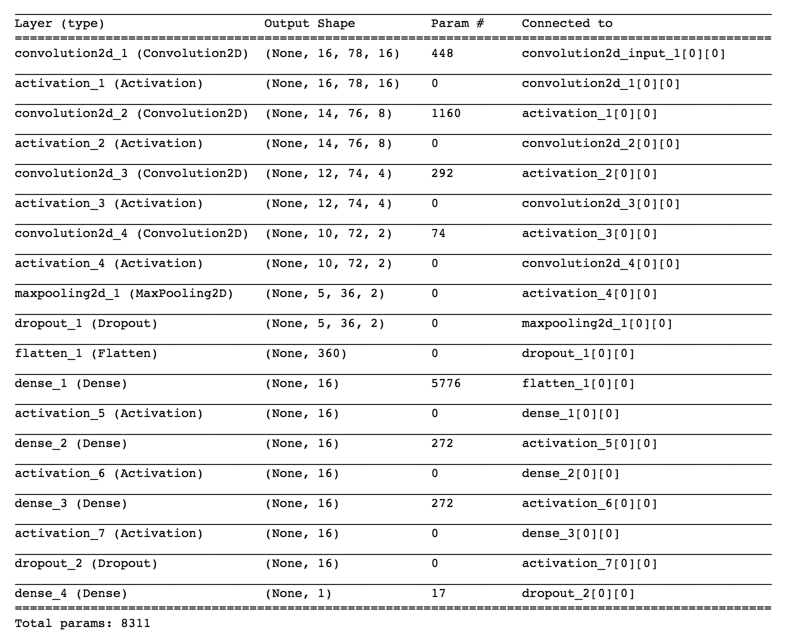

# CarND-behavioral-cloning

##Overview
The goal of this project is to clone the driving behavious in a model using deep learning. We drive car in a simulator and capture the training data. Using that training data, model is trained and finally using this model, the car is driven autonomously in the simulator.  I follow the following steps to accomplish this.  
  1. record the training data
  2. load the driving log in memory  
  2. visualize the images and steering angle  
  3. preprocessing  
  4. build the model  
  5. feed the images/angle to model in batches using generator  
  6. fit the model   
  7. test the model  
  8. save the model  
  9. drive on track using the saved model  

##Preprocessing

Preprocessing image is the most critical part. Here are the images and angle sample before preprocessing. 

I took the following steps to ensure that I am feeding the quality data to model so it will train properly. In the captured images, there are a lot of background noise, trees and mountains  etc. They are not useful in training. They do create distraction in the model. So it is very important to crop the image to right size to only feed the portion of image that are important for model to learn. Here are some sample images after the cropping 

Second, data I collected from training track has images with steering on right. It is skew towards the steering towards right. To tackle that, I flip the images so that the data is more balanced. 

third, I have images from left, right and center camera along with steering angles. We need to adjust steering angle from left and right camera to get the correct input to our model. Also most of the angle in dataset are zero. Adjusting these angle give us more diversed datasets. 

##feed the images/angle using generator  
I used generator to feed the images and angle to model. Instead of loading all images in memeory, the generator will iterate over and fetch only batch of images from disk. It allow me to train the model using a large size of dataset.  

##Model architecture
(Reference: https://github.com/wonjunee/behavioral-cloning)

##Training dataset 
I am using the training datasets provided by Udacity. I found it more accurate than the data I collected. The part of that training using keyboards does not produce the quality datasets. 

##Training and Testing 
Here are the different scenarios I tested.

##Conclusion

